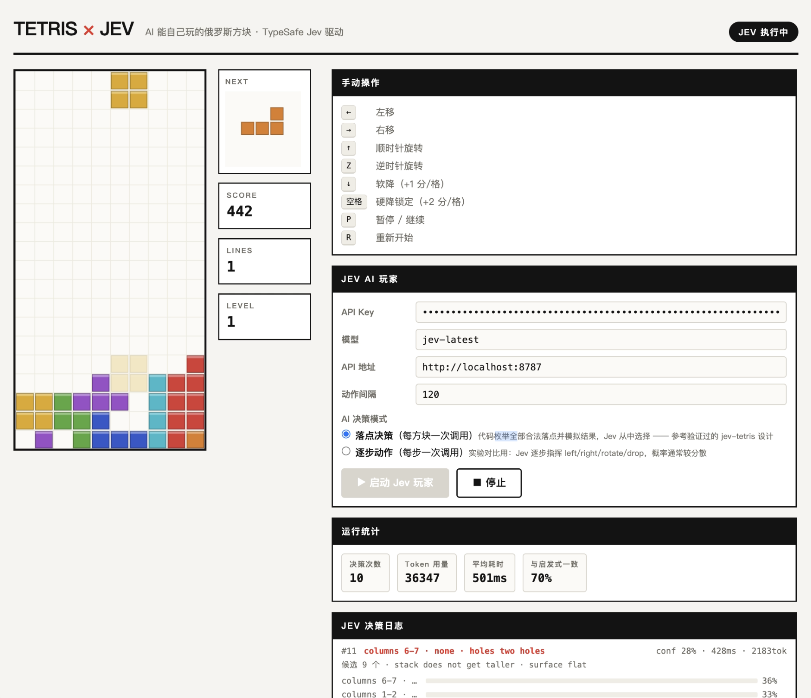

# Tetris × Jev

Web 版俄罗斯方块，内置 **Jev**（TypeSafe System One）AI 玩家，让 AI 自己玩游戏；同时暴露 `window.TetrisAPI` 接口，任何外部智能体（Playwright / Puppeteer / LLM）都能驱动游戏。

- 零依赖：`node jev-proxy.mjs` 一条命令同时托管页面和代理 API
- 内置 Jev 玩家：每个方块一次 API 调用，从全部合法候选落点中做「品味判断」
- 完整决策日志：概率分布、置信度、耗时、token、与经典启发式一致率
- 固定种子评估工具：Node 批量对局，Jev / 启发式 / 随机同环境对照

## 演示



<video src="docs/assets/demo.mp4" controls muted playsinline width="100%"></video>

> 视频无法播放时：[下载演示视频（.mov）](docs/assets/demo.mov)

## 快速开始

TypeSafe API 的 CORS 是 origin 白名单模式，浏览器无法直连，需要先启动本地代理（它同时静态托管页面——index.html 已拆分为 ES module，file:// 直开会被浏览器拦截）：

```bash
# 1. 启动代理（key 放环境变量，或在页面里填）
TYPESAFE_API_KEY=sk-xxxx node jev-proxy.mjs 8787

# 2. 浏览器打开 http://localhost:8787

# 3. 点「▶ 启动 Jev 玩家」，观察决策日志
```

## 评估工具（固定种子批量对局）

`engine.js` 是浏览器 / Node 共享的引擎模块，评估工具用它无头跑批量对局，种子固定、结果可复现，是所有改动的回归基准：

```bash
node eval/harness.mjs --player heuristic --games 100        # 启发式对照（标尺）
node eval/harness.mjs --player random --games 100           # 随机对照
TYPESAFE_API_KEY=sk-... node eval/harness.mjs --player jev --games 20 \
    --log eval/runs/jev-v2.jsonl                            # Jev + 决策日志（供失误诊断）
```

当前基线（100 局固定种子，每局 500 块截断）：启发式平均消行 **193.9**（97 局打满截断），随机 **0**（平均存活 20 块）。Jev 基线待测。

> 注：评估工具上线首日就立功——发现落点枚举漏掉了贴墙落点（旋转矩阵的空边框导致竖直 I 无法落在 column 0 等），修复前启发式也只有平均 5.8 行。该 bug 此前同样限制了 Jev 的候选集。

## 功能特性

- **完整俄罗斯方块玩法**：7 种方块、旋转、软降/硬降、消行计分，键盘操作
- **Jev 玩家 v2（落点决策）**：代码枚举当前方块的全部合法落点并模拟后果（消行/洞/高度/表面），数字转成语义词后交给 Jev 做一次 Choice 判断；同一请求并行携带 strategy / board_health / next_piece_fits 三个投机问题
- **v1 逐步动作模式（对照实验）**：保留失败的第一版——每按一次键问一次 Jev，用于对比
- **决策日志**：每次调用记录候选概率 top3、置信度、耗时、token 消耗、与经典启发式（-0.51h + 0.76c − 0.36o − 0.18b）的一致率

### 实测数据（v1 vs v2，同一环境各 60 秒）

| 指标 | v1 · 逐步动作循环 | v2 · 落点决策 |
| --- | --- | --- |
| 置信度 | 9–23%（概率摊平） | 76–90% |
| 60 秒产出 | 74 次调用，0 消行，112 分 | 69 块全部落定，消 12 行，3094 分 |
| 单次延迟 | 约 400ms | 约 240–400ms（每块仅 1 次） |
| 与经典启发式一致率 | 无法衡量 | 67% |

核心经验：**代码玩游戏，Jev 做判断** —— 枚举、模拟、执行全部交给代码，Jev 只在已算好的选项之间做价值判断。详细技术细节见 [docs/jev-development-guide.html](docs/jev-development-guide.html)。

## 智能体接口 `window.TetrisAPI`

```js
// —— 观测 ——
TetrisAPI.getState()        // 结构化 JSON：棋盘/当前块/分数/消行数
TetrisAPI.getStateText()    // 文本形态，适合直接粘给任何 LLM
TetrisAPI.getPlacements()   // ★ 枚举+模拟+词化一次给全的候选落点表

// —— 动作 ——
TetrisAPI.applyAction(a)    // left/right/rotate/soft_drop/hard_drop
TetrisAPI.executePlacement(p) // ★ 高层动作：直接执行一个落点

// —— 事件 / 控制 ——
TetrisAPI.onEvent("lock", cb) // lock / clear / gameover / score
TetrisAPI.start(); TetrisAPI.setGravity(false) // 关重力 = AI 有无限思考时间
```

用 Playwright 驱动示例：

```js
await page.evaluate(() => TetrisAPI.start());
while (!(await page.evaluate(() => TetrisAPI.getState().gameOver))) {
  const placements = await page.evaluate(() => TetrisAPI.getPlacements());
  const act = await decideWithYourAgent(placements); // Jev / LLM / 启发式均可
  await page.evaluate(p => TetrisAPI.executePlacement(p), act);
}
```

## 项目结构

```
├── index.html                      # 页面：渲染 / 输入 / Jev 玩家 / TetrisAPI
├── engine.js                       # 共享引擎（浏览器 / Node 通用）：引擎 + 落点枚举 + 词化 + Jev 问题构造
├── jev-proxy.mjs                   # 零依赖 Node 代理：CORS 转发 + 静态托管
├── CONTEXT.md                      # 领域术语表（Jev 驱动 / 词化 / 对照玩家 / 劣招标注…）
├── eval/
│   └── harness.mjs                 # 固定种子批量对局评估工具
└── docs/
    ├── jev-development-guide.html  # 完整开发指南（浅色 HTML，可离线阅读）
    ├── adr/                        # 架构决策记录（0001: 决策路径禁止代码估值）
    └── assets/                     # demo.png / demo.mov / demo.mp4
```

## 开发历程（提示词存档）

本项目使用 GLM-5.3-Flash 开发，历经两代提示词迭代，存档如下。

**v1 提示词** —— 初版，AI 玩不起来（概率摊平、决策瘫痪）：

> 参考网站（https://docs.typesafe.ai/）的文档内容，开发一款web版的俄罗斯方块的游戏，要留接口让AI能够自己玩，我想使用 Jev 让它自己玩这个游戏。

**v2 提示词** —— 附上 v1 决策日志（置信度 9–23%、反复 soft_drop、60 秒 0 消行）后诊断重构：

> 你看看文档应该怎么用，是不是应该把整个游戏的实时布局通过 state 告诉 Jev，问题是不是组织的也不对，应该把所有的动作都告诉 Jev，你搜索一下网上使用 Jev 玩游戏都是如何做的。现在通过上面的决策日志可以看到，目前根本不能自动玩。

**文档生成提示词** —— 产出 [docs/jev-development-guide.html](docs/jev-development-guide.html)：

> 基于本次开发实践编写一篇开发 AI 能自己玩的俄罗斯方块的文档，不要限制字数，一定要讲明白技术细节，让没有经验的人能自己开发为智能体用户提供接口的游戏或应用，知道如何集成 Jev，如何组织 Jev 的输入和输出结果的使用。生成 HTML 格式，浅色风格。

## 参考资料

- TypeSafe 官方文档：<https://docs.typesafe.ai/>
- 设计蓝本（code-enumerated legal placements）：<https://github.com/trungdq88/jev-tetris>
